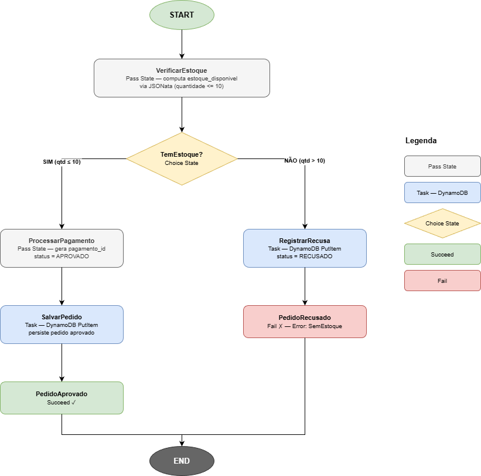
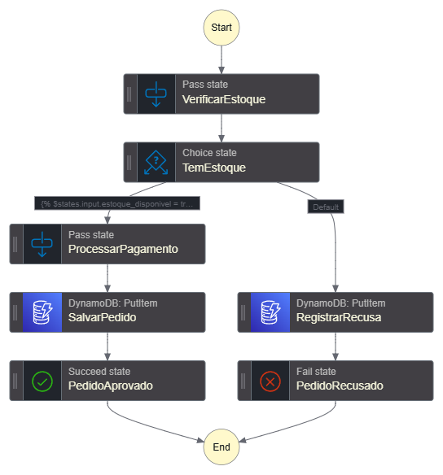
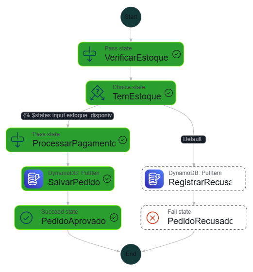
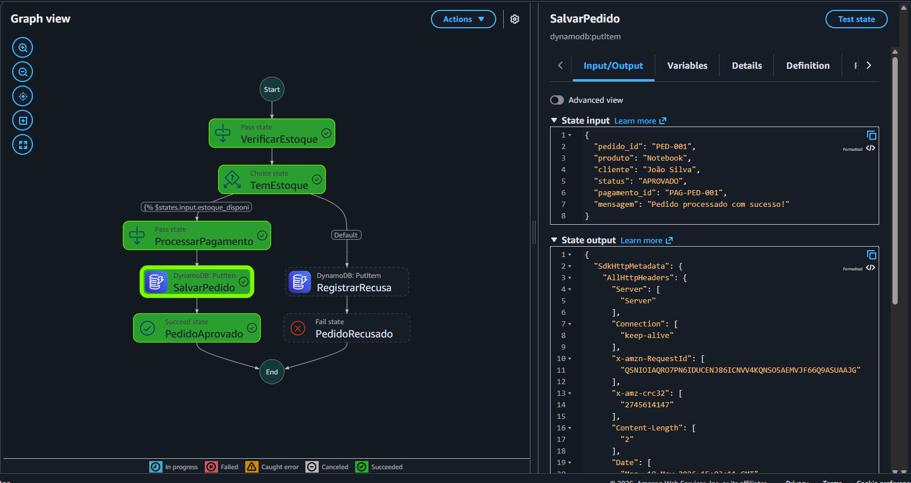
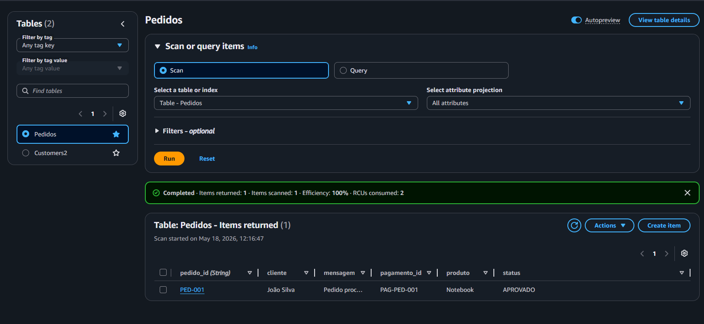
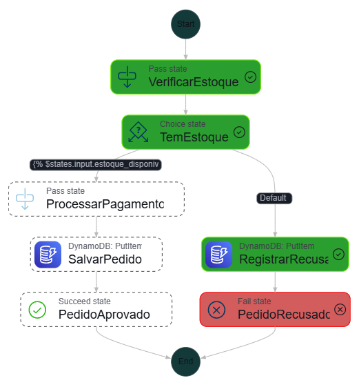
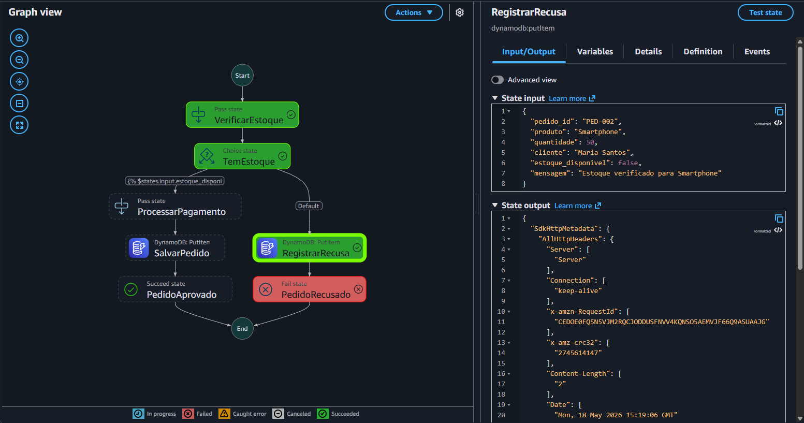
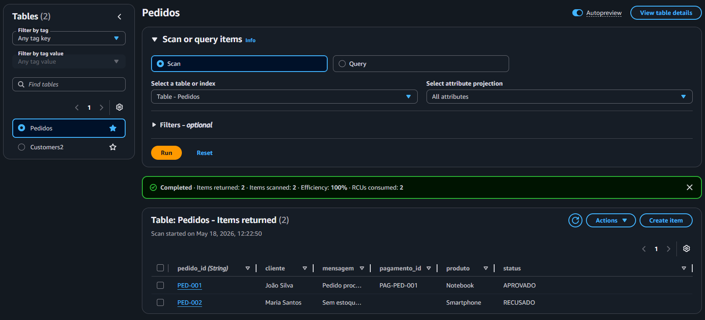
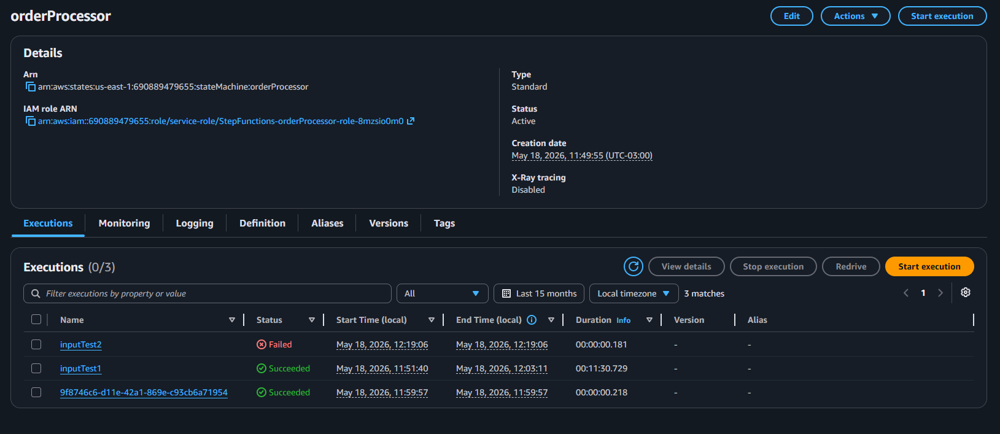

<div align="center">

# Workflows Automatizados com AWS Step Functions

[](https://aws.amazon.com/)
[](https://aws.amazon.com/step-functions/)
[](https://aws.amazon.com/dynamodb/)
[](https://aws.amazon.com/serverless/)
[](.)

**Bootcamp GFT — Fundamentos de Cloud com AWS** · [DIO](https://www.dio.me/)

</div>

---

## 🎯 Objetivo

Este laboratório tem como objetivo consolidar workflows automatizados com AWS Step Functions. O entregável é um repositório organizado contendo anotações e insights adquiridos durante a prática, servindo como material de apoio para estudos e futuras implementações.

---

## ⚙️ Tecnologias Utilizadas

| Serviço | Uso |
|---|---|
| **AWS Step Functions** | Orquestração do workflow (tipo Standard) |
| **Amazon DynamoDB** | Persistência do resultado de cada pedido |
| **Amazon CloudWatch** | Logs de execução (configurado automaticamente) |
| **AWS IAM** | Role com permissão `dynamodb:PutItem` (gerada automaticamente) |

---

## 🏗️ Arquitetura — Processador de Pedidos

O projeto implementa um workflow que simula o fluxo de aprovação de pedidos de e-commerce, **persistindo o resultado no DynamoDB**:

| # | Estado | Tipo | Descrição |
|---|---|---|---|
| 1 | **VerificarEstoque** | Pass | Calcula se há estoque (`quantidade <= 10`) via JSONata |
| 2 | **TemEstoque** | Choice | Decisão: aprovado ou recusado |
| 3 | **ProcessarPagamento** | Pass | Gera o ID de pagamento (caminho aprovado) |
| 4 | **SalvarPedido** | Task | Persiste o pedido aprovado no DynamoDB |
| 5 | **RegistrarRecusa** | Task | Persiste o pedido recusado no DynamoDB |
| 6 | **PedidoAprovado** | Succeed | Estado final — execução bem-sucedida |
| 7 | **PedidoRecusado** | Fail | Estado final — execução encerrada com falha |

### Diagrama do Fluxo



> Arquivo editável disponível em: [`diagrama-fluxo.drawio`](diagrama-fluxo.drawio)

### Workflow Visual no Console AWS



---

## O que é AWS Step Functions?

AWS Step Functions é um serviço de **orquestração de serviços** que permite criar fluxos de trabalho visuais conectando diferentes serviços da AWS. Funciona no modelo **low-code**: você define os estados em JSON (ASL), e o console gera o grafo visual automaticamente.

| Conceito | Descrição |
|---|---|
| **State Machine** | O workflow completo, composto por estados |
| **Pass** | Transforma dados via JSONata sem chamar serviços externos |
| **Task** | Executa um serviço AWS (DynamoDB, Lambda, S3, etc.) |
| **Choice** | Ramifica o fluxo com base em uma condição |
| **Succeed / Fail** | Finaliza a execução com sucesso ou erro |
| **ASL** | Amazon States Language — JSON que define o workflow |
| **JSONata** | Query language para transformar dados dentro do ASL |

> **Step Functions é um orquestrador — ele coordena recursos que já existem, não os cria.** Quem cria e provisiona recursos é o CloudFormation/SAM.

---

## 📋 Como Criar

### Pré-requisito

- Conta AWS ativa (free tier é suficiente — custo estimado: $0,00)

### Passo 1 — Criar a Tabela DynamoDB

> **Importante:** crie a tabela **antes** da State Machine. O Step Functions não cria recursos, apenas os utiliza.

1. No console AWS, acesse **DynamoDB → Criar tabela**
2. **Nome da tabela:** `Pedidos`
3. **Partition key:** `pedido_id` — tipo **String**
4. Mantenha as configurações padrão (On-demand)
5. Clique em **Criar tabela** e aguarde o status **Ativo**

### Passo 2 — Criar a State Machine

1. No console AWS, acesse **Step Functions → Criar máquina de estado**
2. Selecione **Em branco**
3. Clique na aba **Código**, apague o conteúdo existente e cole o JSON do arquivo [`statemachine/order_processor.asl.json`](statemachine/order_processor.asl.json)
4. O grafo visual aparece automaticamente na aba **Design**
5. Clique em **Próximo**
6. **Nome:** `ProcessadorDePedidos` | **Tipo:** Standard
7. Em **Permissões**, selecione **Criar nova função** — a AWS detecta o DynamoDB no ASL e cria a policy automaticamente
8. Clique em **Criar máquina de estado**

---

## 📸 Evidências

### Cenário 1 — Pedido Aprovado (quantidade ≤ 10)

Execute com o payload abaixo em **Iniciar execução**:

```json
{
  "pedido_id": "PED-001",
  "produto": "Notebook",
  "quantidade": 2,
  "cliente": "João Silva"
}
```

Todos os estados do caminho aprovado ficam verdes → `PedidoAprovado` → **SUCCEEDED**



**Detalhe do estado `SalvarPedido`** — input e output da gravação no DynamoDB:



**Registro gravado no DynamoDB:**



---

### Cenário 2 — Pedido Recusado (quantidade > 10)

```json
{
  "pedido_id": "PED-002",
  "produto": "Smartphone",
  "quantidade": 50,
  "cliente": "Maria Santos"
}
```

Fluxo segue o caminho de recusa → `RegistrarRecusa` grava no DynamoDB → `PedidoRecusado` → **FAILED**



**Detalhe do estado `RegistrarRecusa`** — `estoque_disponivel: false` no input:



---

### Resultado Final no DynamoDB

Ambos os registros persistidos na tabela `Pedidos`:



### Histórico de Execuções



---

## 💡 Aprendizados

- **State Machine** com 7 estados encadeados e dois caminhos de execução distintos
- **Pass State** com transformação de dados via **JSONata** — sem necessidade de código externo
- **Choice State** com condição booleana dinâmica calculada em runtime (`quantidade <= 10`)
- **Task State** com integração nativa ao **DynamoDB** (`putItem`) — sem Lambda intermediário
- **Succeed / Fail** como estados terminais com semântica diferente para o status da execução
- **ASL (Amazon States Language)** com `QueryLanguage: JSONata` — sintaxe moderna e expressiva
- **Redrive** — reaproveitamento de execução a partir do estado falho, sem reiniciar o fluxo
- Permissões IAM criadas automaticamente pela AWS a partir da análise do ASL

---

## 🗂️ Estrutura do Repositório

```
desafio-aws-step-functions/
├── README.md
├── diagrama-fluxo.drawio                # Diagrama editável
├── statemachine/
│   └── order_processor.asl.json         # Definição completa da State Machine (ASL)
└── images/
    ├── diagrama-fluxo.png               # Diagrama do fluxo renderizado
    └── testes/
        ├── 01-state-machine-overview.png
        ├── 02-execucao-sucesso-grafo.png
        ├── 03-execucao-sucesso-detalhe.png
        ├── 04-dynamodb-pedido-aprovado.png
        ├── 05-execucao-falha-grafo.png
        ├── 06-execucao-falha-detalhe.png
        ├── 07-dynamodb-todos-registros.png
        └── 08-historico-execucoes.png
```

---

## ✅ Conclusão

Este laboratório demonstrou na prática como o AWS Step Functions elimina a necessidade de código "cola" entre serviços: toda a lógica de orquestração — verificação de estoque, decisão e persistência de dados — foi definida diretamente no ASL, sem uma única linha de código personalizado. A integração nativa com DynamoDB e a geração automática de permissões IAM reforçam como o modelo serverless da AWS permite construir fluxos complexos de forma eficiente e gerenciável.

---

## 📚 Referências

- [AWS Step Functions — Documentação Oficial](https://docs.aws.amazon.com/step-functions/)
- [Amazon States Language](https://docs.aws.amazon.com/step-functions/latest/dg/concepts-amazon-states-language.html)
- [JSONata no Step Functions](https://docs.aws.amazon.com/step-functions/latest/dg/transforming-data.html)
- [Integração Step Functions + DynamoDB](https://docs.aws.amazon.com/step-functions/latest/dg/dynamodb-iam.html)
- [DIO — GFT Fundamentos de Cloud com AWS](https://www.dio.me/)

---

<div align="center">

Desenvolvido como parte do bootcamp **GFT — Fundamentos de Cloud com AWS** na [DIO](https://www.dio.me/)

</div>
